<p align="center">
  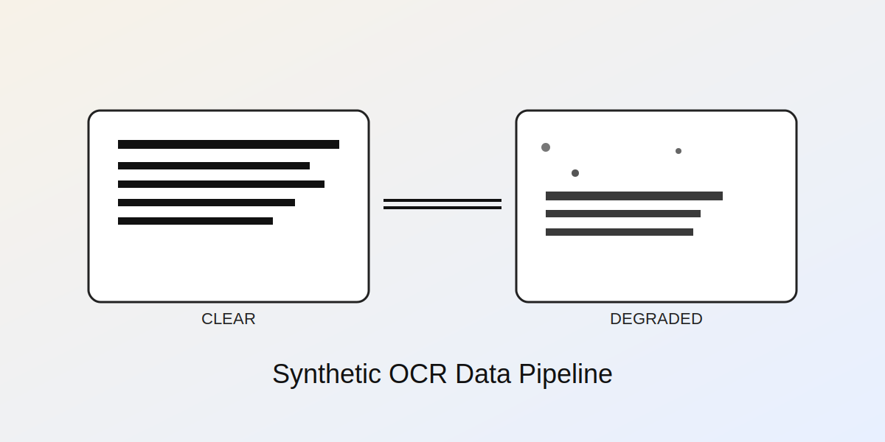
  <h1 align="center">OCR Dataset Generator</h1>
  <p align="center">Synthetic OCR data, from clean text to realistic degradation.</p>
  <p align="center">
    <a href="LICENSE"></a>
    
  </p>
</p>

This project generates synthetic OCR datasets that mimic real-world scanning noise. It creates clean, word-annotated text images and then degrades them with controlled transformations (noise, blur, resize, rotation). The result is a reproducible pipeline that helps you train and benchmark OCR models when real data is scarce or inconsistent.

---

## Quickstart
1) Create and activate a virtual environment.
2) Install runtime dependencies:
   - `pip install -r requirements.txt`
3) (Optional) Install notebook/testing deps:
   - `pip install -r requirements-dev.txt`

Run the CLIs:
```bash
python -m generate_text_images_cli --help
python -m degrade_images_cli --help
```

If installed as a package:
```bash
ocr-generate-text-images --help
ocr-degrade-images --help
```

## CLI Examples
Generate clear text images:
```bash
python -m generate_text_images_cli --text-file data/The_Picture_of_Dorian_Gray.txt --num-images 50 --out-dir output/text
```

Generate degraded images with annotations:
```bash
python -m degrade_images_cli --images-dir output/text/images --annotations output/text/annotations.json --out-dir output/degraded --num-images 50 --skip-tesseract
```
You can disable specific transformations, for example:
```bash
python -m degrade_images_cli --images-dir output/text/images --out-dir output/degraded --no-max-filter --no-min-filter --no-rotate
```
Advanced noise/blur tuning example:
```bash
python -m degrade_images_cli --images-dir output/text/images --out-dir output/degraded --gaussian-mean-min 0.4 --gaussian-mean-max 0.8 --gaussian-std-min 0.02 --gaussian-std-max 0.06 --gaussian-blur-radius-max 4
```

## Visual Preview

<table>
  <tr>
    <td align="center">
      <br>
      Clear Image
    </td>
    <td align="center">
      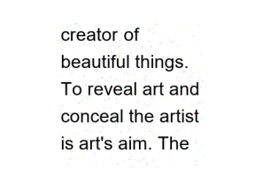<br>
      Gaussian Noise
    </td>
    <td align="center">
      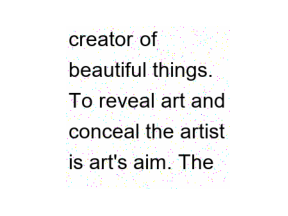<br>
      Speckle Noise
    </td>
  </tr>
  <tr>
    <td align="center">
      <br>
      Salt & Pepper Noise
    </td>
    <td align="center">
      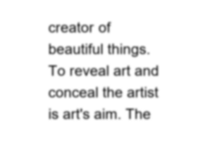<br>
      Gaussian Blur
    </td>
    <td align="center">
      <br>
      Box Blur
    </td>
  </tr>
  <tr>
    <td align="center">
      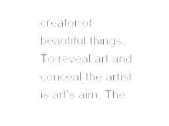<br>
      Max Filter
    </td>
    <td align="center">
      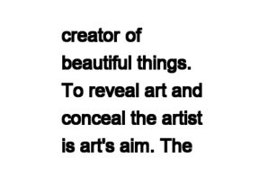<br>
      Min Filter
    </td>
    <td align="center">
      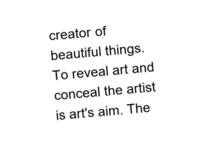<br>
      Rotation
    </td>
  </tr>
  <tr>
    <td align="center">
    </td>
    <td align="center">
      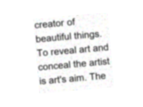
  Composite Degraded Image
    </td>
    <td align="center">
    </td>
  </tr>
</table>

### Some More Examples of Degraded Images

<table>
  <tr>
    <td align="center">
      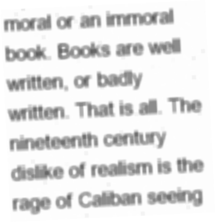<br>
    </td>
    <td align="center">
      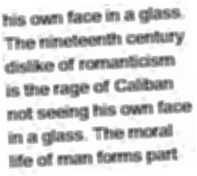<br>
    </td>
    <td align="center">
      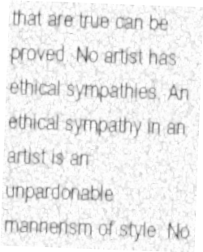<br>
    </td>
  </tr>
  <tr>
    <td align="center">
      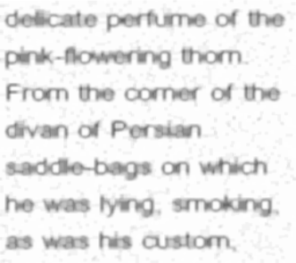
    </td>
    <td align="center">
      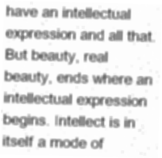
    </td>
    <td align="center">
      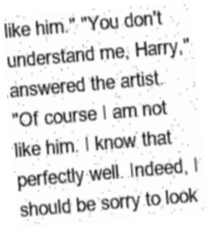
    </td>
  </tr>
</table>

## Output Layout
```
output/
  text/
    images/
    annotations.json
  degraded/
    images/
    annotations.json
```

## Annotation Schema (clear text)
```json
{
  "clear_image_00000.png": {
    "width": 256,
    "height": 256,
    "words": [
      {
        "word": "The",
        "bbox": [0, 0, 21, 12],
        "corners": [[0, 0], [21, 0], [21, 12], [0, 12]]
      }
    ]
  }
}
```

## Annotation Schema (degraded)
```json
{
  "degraded_00000.png": {
    "source_image": "clear_image_00000.png",
    "width": 256,
    "height": 256,
    "psnr": 24.7,
    "tesseract_output": ["..."],
    "tesseract_relative_error": 0.7,
    "words": [
      {
        "word": "The",
        "bbox": [1, 2, 20, 12],
        "corners": [[1, 2], [20, 1], [21, 12], [2, 13]]
      }
    ]
  }
}
```

## Tesseract OCR (optional)
- Install Tesseract from https://github.com/UB-Mannheim/tesseract/wiki
- Pass the path to the executable if needed:
  - `--tesseract-cmd "C:\Program Files\Tesseract-OCR\tesseract.exe"`

## Tests
```bash
python -m unittest tests/test_smoke.py
```

## Notebooks
- `notebooks/example.ipynb`: example workflows
- `notebooks/pipeline_demo.ipynb`: walks through the degradation pipeline incrementally

## Notes
- Sample texts and images live in `data/`.
- Additional utilities are available in `src/` (downscaling, blur, and perspective transform).
